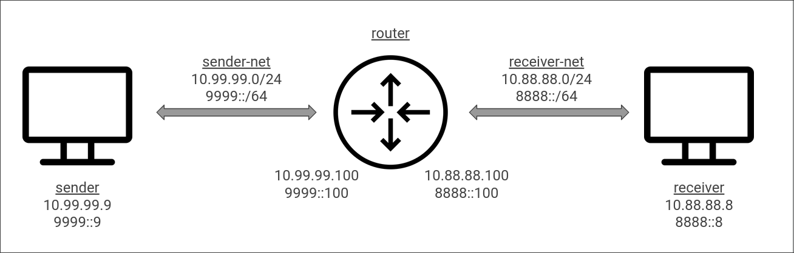

# Showcase of network stegano tools

Each scenario is contained in its own directory and usually consists of a `docker-compose.yml` file that spawns the specific tool and sends some data using the respective interesting method.

## Setup



The network setup is defined in `base.yml`.
There are two networks, one is for the receiver container, other for the sender.

To create the necessary networks run the `create_networks.sh` script.

The receiver has IP addresses: `10.88.88.8/24` and `8888::8/64`.

The sender: `10.99.99.9/24` and `9999::9/64`

There is a router container attached to both networks on respective ips ending with `100` e.g. `10.88.88.100` that faciliates routing between the two networks.

The router container can be extended by each scenario to add some specific firewall rules for testing.

## Running

To test a specific scenario usually it's enough to just:

```bash
cd {directory}
docker compose up
```

You can use a packet sniffer e.g. Wireshark and attach to the `sender-net` or `receiver-net` interface to monitor the traffic between the containers. 

## Docker tips:

After starting the container stack, you can

```bash
docker compose exec <service-name> /bin/sh
```

To get a shell inside the `<service-name>` running container

---

Do

```bash
docker compose -f base.yml up
```

To spawn the base network stack without any scenario if you want to test the base connectivity or something.

# IPv6 Flow label

https://github.com/christophetd/IPv6teal

This tool transfers contents of a file inside the ["Flow label" field of an IPv6 packet](https://www.rfc-editor.org/rfc/rfc6437).

# TCP Sequence Numbers

https://github.com/defensahacker/syn-file

This tool transmits a file using the sequence number field inside a TCP packet.

# Time between ICMP packets

https://github.com/anfractuosity/timeshifter

This tool uses a covert timing channel to send data by varying the delay between ICMP ECHO packets.